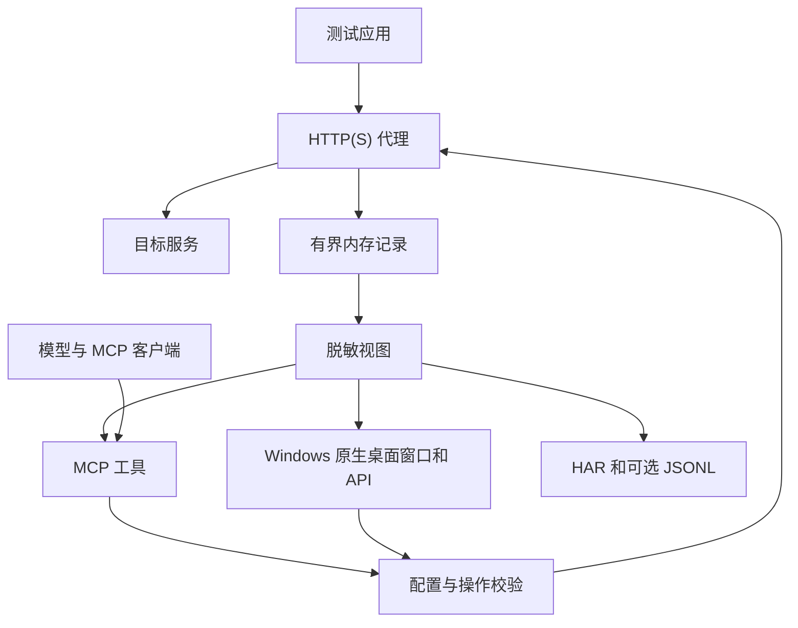
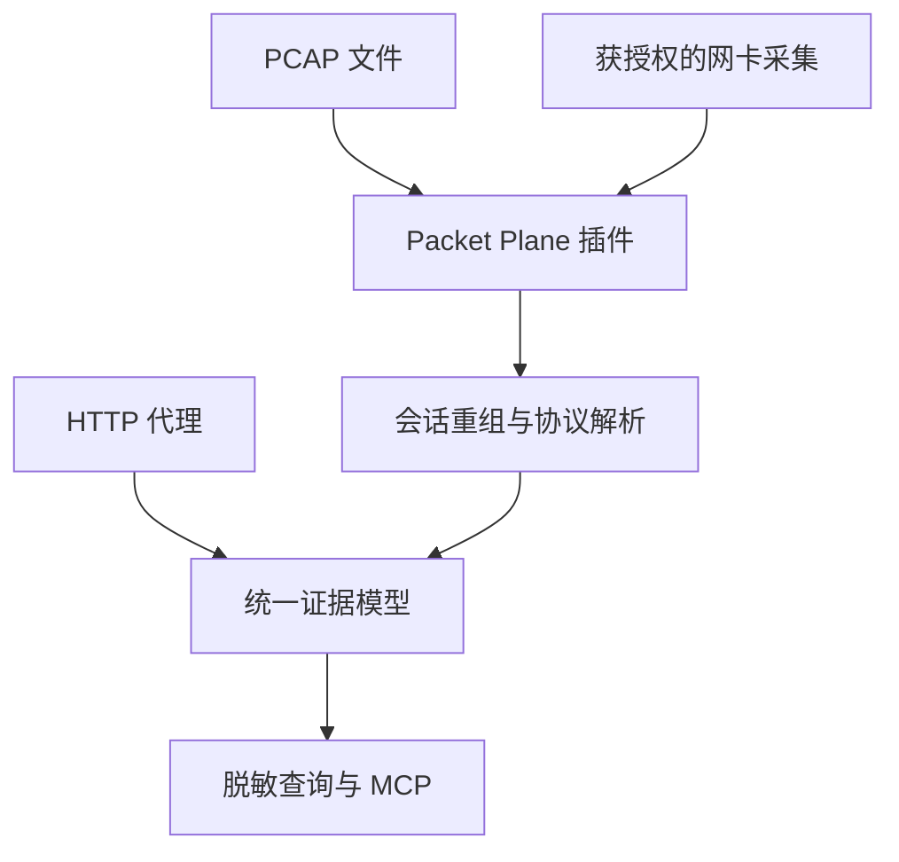

# NetLens 架构与扩展说明

## 1. 目标与当前交付

NetLens 将应用层流量记录与大模型控制连接到同一个本地服务。人通过 Windows 原生桌面窗口查看证据，模型通过 MCP 查询、配置和执行受限制的调试操作。用户仍在自己的客户端或应用中设置 HTTP 代理；未经过该代理的流量不在本版采集范围内。

v0.3.0 交付包含 HTTP(S) 显式代理、有界内存、脱敏公开视图、HAR、可选 JSONL、MCP stdio／Streamable HTTP、Windows 原生桌面窗口、规则与重放。网卡抓包和协议层分析不包含在本版。当前会剥离 HTTP trailers，不支持完整 gRPC 语义，也不提供 gRPC message 解码。

## 2. 数据路径与控制路径

代理使用流式转发，并在读取时只保留受 `body-limit` 限制的正文样本。默认每正文保留上限为 1 MiB。常规详情、HAR 与落盘流量文件使用脱敏视图；原生请求／响应页的“完整正文”模式、flows_body 和认证后的 /api/body 显式读取未脱敏正文。分页输出不拆分 UTF-8；压缩解码具有独立 8 MiB 预算。原始请求的有限保留也为明确授权的重放提供依据。

控制操作可以修改采集配置或规则，查询操作读取内存快照。调用方通过同一 `Service` 进入业务校验，避免桌面、MCP 与 HTTP API 的行为分叉。暂停采集只停止记录；转发和已开启规则继续按配置执行。

## 3. 组件划分

| 组件 | 职责 | 边界 |
|---|---|---|
| `cmd/netlens-desktop` / `internal/desktop` | Windows 原生控件、窗口消息循环、用户操作 | 直接调用脱敏 Service；不使用 HTTP 页面或 WebView |
| `cmd/netlens` | 参数、信号、进程生命周期 | 只组装本地运行配置 |
| `internal/app` | Service、权限校验、API、listener | 业务权限不能只依赖 MCP annotations |
| `internal/proxy` | HTTP 转发、CONNECT、TLS MITM、规则、重放与时间观测 | 验证上游 TLS；防止代理回环；不解析非 HTTP 应用协议 |
| `internal/capture` | 有界记录、查询、统计、脱敏、HAR 和轮转日志 | 常规输出脱敏，完整正文通过独立分页视图读取 |
| `internal/systemproxy` / `internal/wincert` | 用户代理备份／恢复、精确证书信任管理 | 桌面显式确认，不向 MCP 开放系统操作 |
| `internal/model` | Flow、Body、Timings、Filter、Rule | 把采集限制、完成状态和关联 ID 显式表达 |
| `internal/mcpserver` | SDK、工具 schema、传输、结构化结果和错误 | SDK 处理协议，Service 执行实际操作限制 |

MCP 使用 [官方 Go SDK](https://github.com/modelcontextprotocol/go-sdk)，固定版本为 v1.8.0。项目 Go 版本下限为 1.26。工具目录固定，HTTP transport 使用 stateless／JSON response；应用记录在 Service 内存中，不依赖单个 MCP 会话保存。

## 4. 运行方式

| 方式 | 生命周期 | 共享关系 |
|---|---|---|
| `NetLens.exe` | 窗口管理服务生命周期，关闭窗口停止服务 | 原生窗口、HTTP API 和 HTTP MCP 共用引擎 |
| `netlens serve` | 用户独立启动的常驻进程，收到结束信号退出 | HTTP API 和 HTTP MCP 共用引擎 |
| `netlens mcp` 或 `netlens serve --stdio` | MCP 客户端启动子进程，客户端断开后退出 | stdio、HTTP API 和 HTTP MCP 共用这个子进程的引擎 |

stdio 模式也会启动代理和控制 listener，因此不能与同端口的另一个进程同时使用。连接已有服务应选 HTTP 方式。多个 MCP 客户端连到同一个 HTTP 实例时会共享记录、过滤器和规则；本版没有每客户端隔离或多租户权限。

默认仅监听 `127.0.0.1:8080` 和 `127.0.0.1:9090`。HTTP 控制操作验证 Bearer token，校验 Host 和同源 Origin，不提供网页。stdio 使用本地父子进程关系作为接入边界；服务日志写 stderr，stdout 只允许 MCP 帧。有关传输约束见 [MCP 官方规范](https://modelcontextprotocol.io/specification/2025-11-25/basic/transports)。

## 5. TLS 处理

### HTTPS 隧道模式

未开启 MITM 时，CONNECT 建立隧道后转发加密数据。记录的是隧道级信息，无法从该记录取得 HTTPS 明文方法、业务 Header 或 JSON 正文，也无法把隧道作为 HTTP 请求重放。

### HTTPS MITM 模式

开启 `--mitm` 后，代理使用本实例 CA 为目标主机生成证书。客户端必须明确信任这个 CA。NetLens 与上游建立另一条 TLS 连接并验证其正常证书链和主机名；内部自签服务需要单独配置对应信任根。

CA 位于 `<data-dir>/ca/`。`ca.pem` 可用于客户端信任，`ca-key.pem` 是本实例私钥。桌面按钮可显式安装／检查／移除本实例用户级根证书；上游 TLS 校验不能关闭。证书锁定和客户端 mTLS 不在当前支持范围内。

## 6. 记录与数据语义

每条 Flow 有稳定 `id`、单调查询序号、开始时间、请求／响应、源类型、规则 ID、父请求 ID、时间观测和 `completed`。请求重放产生新 Flow，用 `parent_id` 指向源请求。

正文结构区分“总共读取了多少字节”和“实际保留了多少字节”。达到采集上限后继续转发，但不继续扩充保留正文。公开视图还区分采集截断和展示截断，避免模型把看不到的数据判成空值或内容一致。

默认最多保留 1000 条、估算 64 MiB。保留内存估算不是进程 RSS 或并发请求占用上限。被淘汰的记录不能通过 ID 获取；状态提供淘汰与存储计数。`flows_stats` 使用当前保留样本，不能作为全量历史统计。

采集配置在请求处理时被读取。只有方法／host 一类可提前判定的条件允许活动流先进入记录；状态码、耗时、错误等结果条件需要等完成后决定是否记录。SSE 转发会及时 flush，有界正文和最终时间快照可能在完成时才更新。超时对流式请求和 CONNECT 隧道同样生效。

### 时间解释

时间通过 [Go `httptrace`](https://pkg.go.dev/net/http/httptrace) 观测上游请求事件。DNS、连接、TLS 阶段描述代理到上游的操作；复用连接可能不发生这些事件，0 值本身不表示异常。

TTFB 从代理处理开始到响应首字节，可能包含本地规则延迟、建连、发送和网络等待。它不能独立证明服务端处理慢。总时长还包含响应传输与下游消费；此处没有 TCP 包级重传证据，也没有服务端 span。

## 7. 输出脱敏

脱敏统一覆盖 UI、API、MCP、HAR 和 JSONL。常见敏感字段名及其大小写／分隔符变体被识别；URL 的敏感查询参数、常见凭据 Header、Cookie、JSON 嵌套对象与表单字段使用同一策略。

只对完整 JSON 对象／数组及 URL 编码表单提供正文展示。无效／截断结构、二进制、未知媒体类型和压缩正文被隐藏。上游 Transport 明确关闭自动解压，非 identity Content-Encoding 不进入公开正文展示。未知字段中未标注的秘密无法保证被识别，部署到具体业务前需要根据数据约定扩展策略。

网络内容还可能含有针对模型的提示注入。服务说明把流量声明为不可信证据；响应中出现的命令、链接或工具调用要求不会自动成为权限依据。规则、重放和清空等操作仍由 Service 校验启动配置和本次参数。

工具结果有总大小上限，默认返回摘要或有限预览。模型应先使用筛选／统计缩小范围，再读取代表请求。对比只覆盖可见脱敏字段和有限正文，隐藏内容保持未知。

规则替换与重放等变更操作返回有限大小的回执，详情通过 `rules_list` 或 `flows_get` 查询。这样可以避免“操作已执行，但完整结果超限”的失败表象让模型重复发送实际操作。重放回执的 `retained` 描述该请求是否仍能在内存查询；采集暂停或过滤未命中时不应假定详情必然存在。

## 8. 主动调试边界

| 操作 | 约束 |
|---|---|
| 替换规则 | 启动时 `--allow-rules`；每条显式 `match.hosts`；整体替换，最多 32 条 |
| 修改 Header | 只接受合法 Header 名与值；Host、连接控制和 framing 相关字段不可任意改写 |
| 延迟 | 每条最多 5000 ms，可被请求 context 取消 |
| Mock | 状态码／正文组合受校验，正文最多 64 KiB；按顺序遇到首个 Mock 后返回 |
| 重放 | 启动时 `--allow-replay` 与调用时 `confirm:true`；只允许同 scheme／主机／有效端口 |
| 重放正文 | 原请求完整，或提供完整替换正文；原始 CONNECT 不支持 |
| 重放认证 | 原始内存 Header 可能仍含凭据；原请求过期凭据不会被自动刷新 |
| 清空 | 需要 `confirm:true`；只清空内存；活动请求之后仍可能完成并进入记录 |

同源约束不等于操作无副作用。重放 POST／计费／写入操作可能再次改变目标系统；业务流程应明确测试环境与用户授权。MCP Tool annotations 帮助客户端展示风险，实际权限仍在代码中执行。

## 9. 可选持久化

`--persist` 只把完成的脱敏记录写为 JSONL。默认单文件 10 MiB，保留 3 个轮转备份。状态暴露写入错误计数，便于识别文件系统问题。日志不保存原始 Header／正文，也不在启动时重建查询索引。

`flows_clear` 不删除 JSONL。`recent_actions` 只记录内存里的最近部分控制操作，不提供持久化审计、跨进程关联或不可抵赖性。

## 10. 下一阶段：Packet Plane 插件

需要 Wireshark 一类能力时，新增独立的包采集与会话分析入口，保留当前 HTTP 调试入口：

建议按以下顺序扩展，并为每步提供独立能力声明：

1. **先读离线 PCAP／PCAPNG**：没有网卡权限依赖，便于稳定复现测试、协议解析与时间索引。
2. **添加 TCP 会话重组**：明确缺包、乱序、重传、截断和重组不完整的证据字段，避免把包计数直接当请求计数。
3. **增补协议解析**：HTTP/2、DNS、WebSocket、gRPC 等各自声明解析层级和缺失信息。
4. **添加实时采集适配器**：按 Linux／Windows／macOS 的实际能力选择实现，把系统权限限制在独立组件中。
5. **关联代理与包级证据**：使用时间、端点、连接标识和请求关联信息，区分可证实的关联与推测。
6. **增加 MCP 工具**：如设备列表、采集任务、PCAP 导入、会话查询；只在插件实际可用时暴露。

这些是设计方向，当前发行包不包含上述插件。扩展后仍需保持输出限额、协议数据不可信、正文脱敏和主动操作的授权边界。

## 11. 验证入口

基础入口是 `go test ./...`、`go vet ./...` 和在受支持环境中的 `go test -race ./...`。本地 demo 用于验证普通请求、错误、延迟、SSE、长正文和独立 TLS 信任链。实际执行结果以交付说明和运行输出为准。

集成验证应关注不同组件间的可见行为：MCP 初始化后能找到工具，过滤配置真实影响记录，HTTP 与 stdio 读到同一引擎状态，HTTPS 上游继续验证证书，脱敏内容不从 API／导出逃逸，停止服务能结束活动连接。

## 12. 官方参考

- [MCP 官方 Go SDK](https://github.com/modelcontextprotocol/go-sdk)
- [MCP 传输规范](https://modelcontextprotocol.io/specification/2025-11-25/basic/transports)
- [MCP Tools 规范](https://modelcontextprotocol.io/specification/2025-11-25/server/tools)
- [Go net/http](https://pkg.go.dev/net/http)
- [Go HTTP 客户端追踪](https://pkg.go.dev/net/http/httptrace)
- [Go X.509 系统证书池](https://pkg.go.dev/crypto/x509#SystemCertPool)
